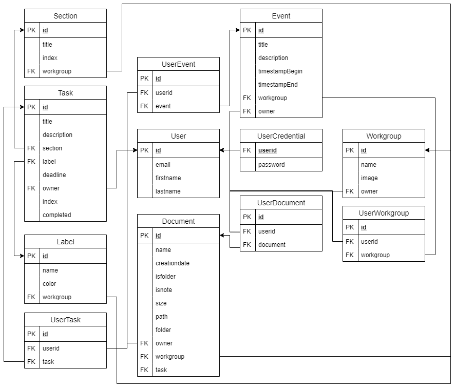

# MeetBox Server 

Progetto realizzato per il corso di Linguaggi e tecnologie per il web.

In questa repository si trova il lato back-end di MeetBox.
Puoi trovare il codice lato front-end [qui](https://github.com/ErVincit/meetbox-client).

## Informazioni

### Gestione dei documenti tramite PHP
Per il salvataggio dei documenti nel server abbiamo preferito usare un server separato scritto in PHP.
Questo perchè l'attuale hosting che usiamo ([Heroku](https://www.heroku.com/)) non ci permette di mantenere file locali per più di 24 ore,
per questa ragione abbiamo realizzato un server PHP, hostato invece su [Altervista](https://it.altervista.org/),
che ci mette a disposizione anche uno spazio per la memorizzazione di file.
Di conseguenza usiamo la libreria [Request](https://www.npmjs.com/package/request) per inoltrare le richieste di upload e download
che riceve il server in Node al server in PHP.

### Schema relazione del DB

### Gestione sessioni utente
Per la gestione delle sessioni abbiamo deciso di usare un JSON Web Token (JWT), ovvero un JSON criptato mediante una chiave che permette la memorizzazione di qualsiasi informazione. Nel nostro caso, qualora un utente si loggasse correttamente, andremmo a creare un cookie di sessione che avrà come valore un JWT, contenente l'id dell'utente autenticato (assegnatogli durante la registrazione).
Ad ogni richiesta il cookie che riceveremo nel nostro server verrà decodificato e saranno prese le informazioni contenute nel JWT, ovvero l'id dell'utente. In questo modo possiamo non memorizzare il cookie nel database poichè le informazioni saranno fornite direttamente dall'utente ad ogni richiesta in tutta sicurezza.

## Tecnologie
- Node.js: come ambiente di esecuzione
- Express: per la realizzazione delle API
- Request: per rinoltrare le richieste per l'upload e download di file al server PHP
- Cookie-Session: per la gestione dei cookie lato client
- Jsonwebtoken: per la creazione e la validazione dei token da assegnare agli utenti tramite cookie
- Pg: per la connessione al database in PostgreSQL
